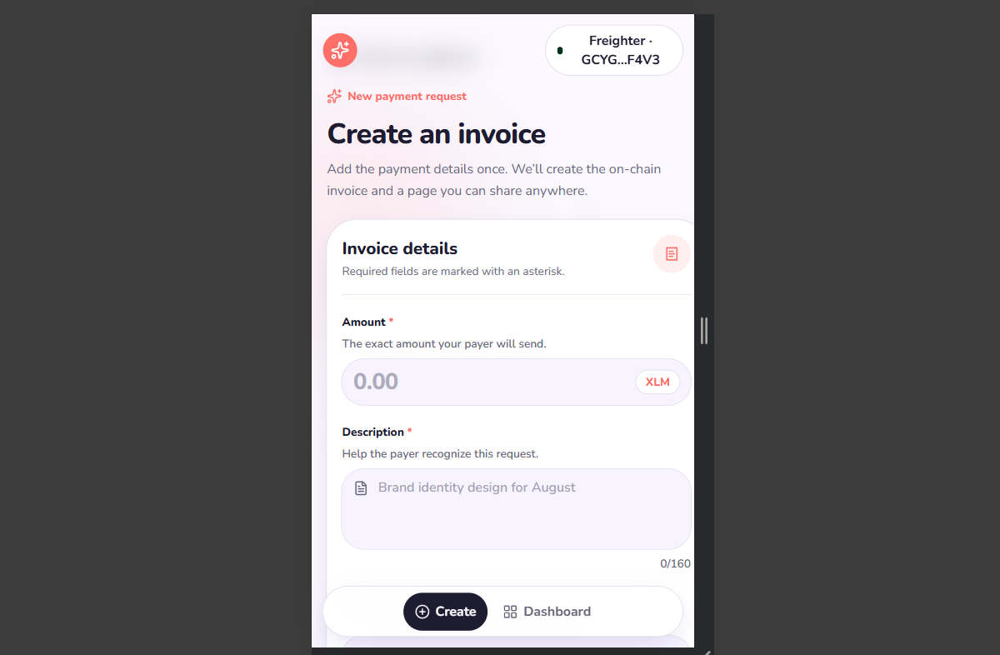
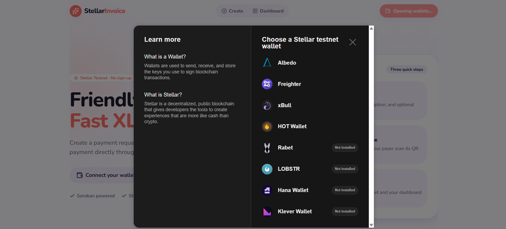
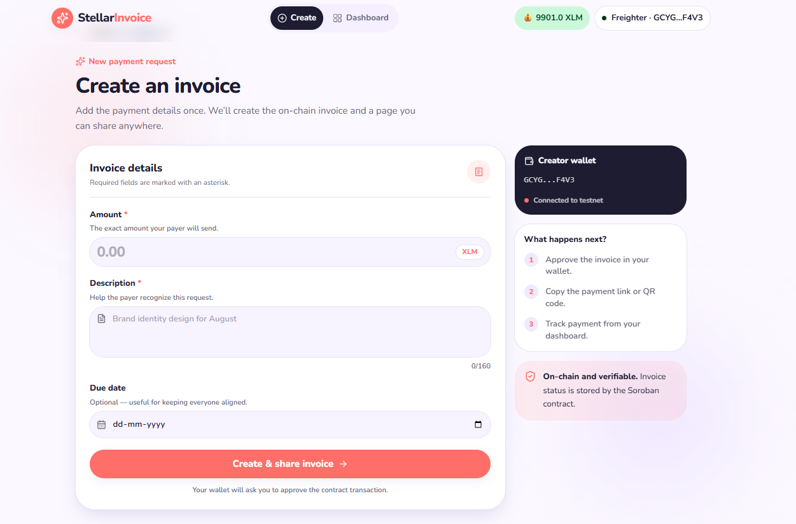
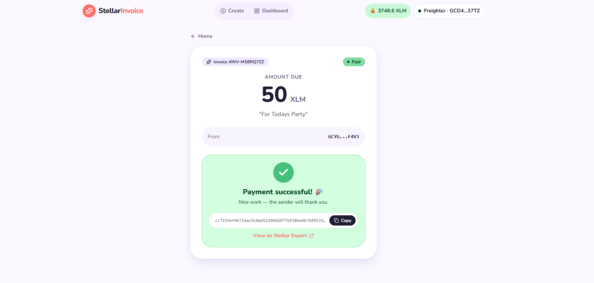

# StellarInvoice | Smart Invoicing on Stellar


**StellarInvoice** is a mobile-responsive Stellar testnet dApp for creating shareable XLM invoices and paying them through a Soroban smart contract.

It combines multi-wallet support, QR-code payment links, native XLM transfers, contract events, transaction tracking, automated tests, and a deployment pipeline in one end-to-end invoicing experience.

> Stripe Invoicing, but on Stellar.

---

## Live Demo

| Resource               | Link                                                                                                                                  |
| ---------------------- | ------------------------------------------------------------------------------------------------------------------------------------- |
| Frontend               | [Open StellarInvoice](https://stellar-invoice-mauve.vercel.app/)                                                                      |
| Contract               | [Open in Stellar Lab](https://lab.stellar.org/r/testnet/contract/CAZDIM6GMNYMY7FRY3LOZQ5IOXM3QE55GHMHNOYKNXI52ATE5JZ3QSZL)            |
| Deployment transaction | [View on Stellar Expert](https://stellar.expert/explorer/testnet/tx/ae2fa58566cc641853b7c5f000570cb0ffef6005855d81009a1147904f0832a1) |
| Payment transaction    | [View on Stellar Expert](https://stellar.expert/explorer/testnet/tx/cc715fef46716ac9c0ad522966d977b938be4b7b99533866d9a6a6a7ca1fd63e) |
| Demo video             | Add the 1–2 minute demo video before submission                                                                                       |

---

## 📱 Mobile UI & 🚀 CI/CD Evidence

| Mobile-responsive interface | CI/CD pipeline passing |
| --- | --- |
|  |  |

The CI pipeline validates the frontend and Soroban contract, while Vercel automatically deploys
the production application after successful repository updates.

---

## Level 1 — White Belt

Focus: wallet connection, Testnet balance handling, and a successful XLM transaction.

| Requirement | Status | StellarInvoice implementation and evidence |
| --- | --- | --- |
| Freighter wallet on Testnet | ✅ Complete | Freighter is available through Stellar Wallets Kit; the application is configured for Stellar Testnet |
| Connect and disconnect | ✅ Complete | Wallet selection, persistent connection state, protected routes, and automatic redirects |
| Display XLM balance | ✅ Complete | Horizon balance lookup and the connected-wallet balance badge |
| Send an XLM transaction | ✅ Complete | `pay_invoice` transfers native XLM through the Stellar Asset Contract |
| Success and failure feedback | ✅ Complete | Pending, signing, success, error, transaction hash, and Explorer states |
| README and screenshots | ✅ Complete | Landing, connected wallet, balance, and successful payment screenshots are included below |
| Public repository | ✅ Complete | [Kratika-12/StellarInvoice](https://github.com/Kratika-12/StellarInvoice) |

## Level 2 — Yellow Belt

Focus: multi-wallet support, deployed smart-contract interaction, and real-time synchronization.

| Requirement | Status | StellarInvoice implementation and evidence |
| --- | --- | --- |
| Stellar Wallets Kit | ✅ Complete | Multi-wallet selector supporting Freighter, Albedo, xBull, HOT Wallet, Rabet, LOBSTR, Hana, Klever, and others |
| Three or more error types | ✅ Complete | Missing wallet, rejected signature, insufficient balance, RPC/network, validation, and contract errors |
| Contract deployed on Testnet | ✅ Complete | Contract ID and deployment transaction are published below |
| Contract called from frontend | ✅ Complete | Frontend invokes `create_invoice`, `get_invoice`, and `pay_invoice` |
| Read and write contract data | ✅ Complete | Invoice creation, lookup, status, payer, and transaction state |
| Transaction status visible | ✅ Complete | Pending, successful, and failed transaction states with Explorer link |
| Real-time event handling | ✅ Complete | Soroban RPC event polling refreshes dashboard and payer views |
| Interaction transaction | ✅ Complete | [View the payment on Stellar Expert](https://stellar.expert/explorer/testnet/tx/cc715fef46716ac9c0ad522966d977b938be4b7b99533866d9a6a6a7ca1fd63e) |
| Multi-wallet screenshot | ✅ Complete | Included in the Screenshots section |

## Level 3 — Orange Belt

Focus: advanced contracts, production architecture, automated quality gates, and complete delivery evidence.

| Requirement | Status | StellarInvoice implementation and evidence |
| --- | --- | --- |
| Advanced smart-contract development | ✅ Complete | Authenticated lifecycle, validation, persistent state, duplicate/payment protection, and events |
| Inter-contract communication | ✅ Complete | Invoice contract invokes the native Stellar Asset Contract to transfer XLM |
| Event streaming and real-time updates | ✅ Complete | Soroban RPC event polling and automatic UI refresh |
| CI/CD pipeline | ✅ Complete | GitHub Actions runs lint, typecheck, frontend tests/build, contract tests/build, and uploads WASM; passing screenshot included |
| Contract deployment workflow | ✅ Complete | Repeatable Testnet workflow in `contracts/deploy.ps1` |
| Mobile-responsive frontend | ✅ Complete | Responsive landing, dashboard, create-invoice, and payer interfaces; mobile screenshot included |
| Error handling and loading states | ✅ Complete | Wallet, network, balance, validation, contract, loading, empty, and transaction states |
| Frontend and contract tests | ✅ Complete | 4 frontend and 4 Soroban contract tests |
| Production-ready architecture | ✅ Complete | Typed modules, route protection, environment configuration, server functions, and documented architecture |
| Public GitHub repository | ✅ Complete | [Kratika-12/StellarInvoice](https://github.com/Kratika-12/StellarInvoice) |
| Minimum 10 meaningful commits | ✅ Complete | More than 10 meaningful commits prepared |
| Live demo | ✅ Complete | [stellar-invoice-mauve.vercel.app](https://stellar-invoice-mauve.vercel.app/) |
| Contract address and transactions | ✅ Complete | Contract ID, deployment hash, and payment hash are published below |
| Product and mobile screenshots | ✅ Complete | Seven labeled product screenshots are included below |
| Passing CI screenshot | ✅ Complete | GitHub Actions and Vercel checks are shown below |
| Demo video | ⏳ Required | Record and publish a 1–2 minute walkthrough |

## Final Submission Readiness

The repository, live demo, deployed contract, payment transaction, documentation, and product
screenshots are ready. The remaining owner-provided evidence is listed at the end of this README.

---

## Features

| Feature                     | Description                                                                                                                |
| --------------------------- | -------------------------------------------------------------------------------------------------------------------------- |
| Multi-wallet connection     | Freighter, xBull, Albedo, Rabet, Lobstr, Hana, HOT Wallet, Klever, and other supported wallets through Stellar Wallets Kit |
| Testnet wallet funding      | Request test XLM from Friendbot inside the interface                                                                       |
| Balance display             | Fetch and display the connected wallet’s native XLM balance                                                                |
| Invoice creation            | Create an invoice with an amount, description, and optional due date                                                       |
| On-chain invoice state      | Store invoice creator, amount, description, status, and payer in Soroban                                                   |
| Shareable payment links     | Generate a dedicated payer URL for every invoice                                                                           |
| QR-code payments            | Scan a generated QR code to open the payer page                                                                            |
| Contract-based payment      | Invoke `pay_invoice` instead of bypassing the contract                                                                     |
| Inter-contract XLM transfer | Invoice contract calls the native Stellar Asset Contract to transfer XLM                                                   |
| Transaction lifecycle       | Display pending, signing, submitted, successful, and failed states                                                         |
| Real-time synchronization   | Refresh dashboard and payer state when the contract emits an event                                                         |
| Invoice dashboard           | Search and filter pending and paid invoices                                                                                |
| Explorer links              | Open successful transactions directly in Stellar Expert                                                                    |
| Automated CI                | Test and build the frontend and contract on pushes and pull requests                                                       |

---

## Error Handling

StellarInvoice provides specific, recoverable feedback for:

- Wallet extension not installed or unavailable
- Wallet connection or signature rejection
- Insufficient XLM balance
- Stellar RPC or network failure
- Invalid, zero, negative, or over-precision amounts
- Missing contract configuration
- Duplicate invoice IDs
- Unknown invoices
- Repeated invoice payments
- Failed or long-pending contract transactions

No wallet secret key is transmitted to or stored by the application.

---

## Contracts and Transactions

| Item                   | Value                                                              |
| ---------------------- | ------------------------------------------------------------------ |
| Network                | Stellar Testnet                                                    |
| Invoice contract ID    | `CAZDIM6GMNYMY7FRY3LOZQ5IOXM3QE55GHMHNOYKNXI52ATE5JZ3QSZL`         |
| Deployment transaction | `ae2fa58566cc641853b7c5f000570cb0ffef6005855d81009a1147904f0832a1` |
| Payment transaction    | `cc715fef46716ac9c0ad522966d977b938be4b7b99533866d9a6a6a7ca1fd63e` |
| Contract functions     | `create_invoice`, `get_invoice`, `pay_invoice`                     |
| Contract events        | `Created`, `Paid`                                                  |
| Payment asset          | Native XLM Stellar Asset Contract                                  |
| Deployer address       | `GCMURRXBRCMC6CKA7V34LNJJLXGXF75RN74H4TI5JTUUPVOI4XMPXFD6`         |

### Contract behavior

`create_invoice`:

- Requires creator authorization
- Rejects zero or negative amounts
- Rejects duplicate invoice IDs
- Stores the invoice on the Soroban ledger
- Publishes a `Created` event

`pay_invoice`:

- Requires payer authorization
- Rejects unknown or already-paid invoices
- Calls the native token contract to transfer XLM
- Records the payer and paid status
- Publishes a `Paid` event

---

## Tests

### Verified results

| Suite                     | Result   |
| ------------------------- | -------- |
| Frontend test files       | 1 passed |
| Frontend tests            | 4 passed |
| Soroban contract tests    | 4 passed |
| TypeScript typecheck      | Passed   |
| Production frontend build | Passed   |
| Release WASM build        | Passed   |

### Run the frontend checks

```powershell
npm install
npm run test
npm run typecheck
npm run lint
npm run build
```

Run every frontend quality gate with one command:

```powershell
npm run verify
```

### Run the contract checks

```powershell
Set-Location contracts/invoice
cargo test
rustup target add wasm32v1-none
cargo build --target wasm32v1-none --release
```

---

## Setup

### Requirements

- Node.js 22.12 or newer
- npm
- Rust stable
- Stellar CLI 25 or newer
- A supported Stellar wallet configured for Testnet

### Install and run

```powershell
git clone https://github.com/Kratika-12/StellarInvoice.git
Set-Location StellarInvoice
npm install
Copy-Item .env.example .env.local
npm run dev
```

Open the local URL printed by Vite. The current development configuration normally uses:

```text
http://localhost:8080
```

### Environment configuration

```env
VITE_CONTRACT_ID=CAZDIM6GMNYMY7FRY3LOZQ5IOXM3QE55GHMHNOYKNXI52ATE5JZ3QSZL
```

Only public contract configuration belongs in Vite environment variables. Never add wallet secret keys.

---

## Soroban Contract Deployment

The automated PowerShell workflow configures Testnet, creates or reuses the local deployer identity, builds the WASM, deploys the contract, verifies `get_invoice`, and writes the public contract ID to `.env.local`.

```powershell
Set-Location contracts
.\deploy.ps1
```

### Manual deployment

```powershell
Set-Location contracts/invoice

rustup target add wasm32v1-none
cargo build --target wasm32v1-none --release

stellar contract deploy `
  --wasm target/wasm32v1-none/release/stellar_invoice_contract.wasm `
  --source-account deployer `
  --network testnet `
  --alias stellar_invoice
```

Verify the deployed contract:

```powershell
stellar contract invoke `
  --id CAZDIM6GMNYMY7FRY3LOZQ5IOXM3QE55GHMHNOYKNXI52ATE5JZ3QSZL `
  --source-account deployer `
  --network testnet `
  -- `
  get_invoice `
  --id VERIFY-NOT-FOUND
```

The expected result for an unknown invoice is `null`.

---

## Architecture

```text
┌─────────────────────────────────────────────────────────┐
│                  React + TanStack Start                 │
│ Create Invoice │ Pay Invoice │ Dashboard │ Wallet UI   │
└──────────────────────────┬──────────────────────────────┘
                           │
                 Stellar Wallets Kit
                           │
             Wallet selection and transaction signing
                           │
                 Stellar Testnet RPC/Horizon
                    ┌──────┴──────┐
                    │             │
          Invoice Contract    Contract Events
                    │             │
         Native XLM Contract      └── UI synchronization
                    │
              XLM transfer

TanStack server functions ── db.json metadata index
```

### Transaction flow

1. The creator connects a Testnet wallet.
2. The frontend validates and converts XLM to stroops.
3. The wallet signs a `create_invoice` Soroban invocation.
4. The contract stores the invoice and emits `Created`.
5. The app saves searchable off-chain display metadata.
6. A payer opens the invoice link and connects another wallet.
7. The wallet signs `pay_invoice`.
8. The invoice contract invokes the native XLM contract.
9. The contract stores the paid state and emits `Paid`.
10. The dashboard detects the event and refreshes automatically.

---

## Project Structure

```text
stellar-spark-main/
|-- .github/
|   `-- workflows/
|       `-- ci.yml
|-- contracts/
|   |-- deploy.ps1
|   `-- invoice/
|       |-- Cargo.toml
|       |-- Cargo.lock
|       `-- src/
|           `-- lib.rs
|-- public/
|-- src/
|   |-- components/
|   |   `-- AppShell.tsx
|   |-- lib/
|   |   |-- invoice.ts
|   |   |-- invoice.test.ts
|   |   |-- server-db.ts
|   |   `-- stellar.tsx
|   |-- routes/
|   |   |-- index.tsx
|   |   |-- create.tsx
|   |   |-- dashboard.tsx
|   |   `-- pay.$id.tsx
|   `-- styles.css
|-- .env.example
|-- CONTEXT.md
|-- brand.md
|-- package.json
|-- README.md
`-- vitest.config.ts
```

---

## Demo Walkthrough

1. Open StellarInvoice at a mobile viewport.
2. Select **Choose Wallet** and connect a Testnet wallet.
3. Verify the wallet name, address, and XLM balance.
4. Use **Fund Wallet** if the account needs test XLM.
5. Create an invoice and approve the contract call.
6. Copy or scan the generated payment link.
7. Open the link with a second Testnet wallet.
8. Pay the invoice and approve the contract transaction.
9. Show the successful transaction hash and Stellar Expert page.
10. Return to the dashboard and show the automatic Paid update.

---

## Screenshots

### Landing page


### Multi-wallet selector



### Dashboard


### Create invoice



### Mobile-responsive interface


### Generated invoice and QR code


### Successful payment



### CI/CD pipeline passing


## Final Submission Actions

These steps require the project owner’s browser, wallet approval, hosting account, or submission
account and cannot be completed by a local build alone:

1. Push the current working tree to the public GitHub repository.
2. Confirm the updated GitHub Actions workflow still passes on `main`.
3. Record and upload the 1–2 minute walkthrough described in Demo Walkthrough.
4. Add the video URL and submit the repository for each selected challenge period.

---

## Next Iteration Plan

- Replace the local JSON metadata index with a transactional hosted database.
- Add authenticated, wallet-scoped dashboard queries.
- Store and query the complete invoice index from contract events.
- Add invoice expiry and partial-payment support.
- Add USD estimates, templates, recurring invoices, and payment reminders.
- Complete an independent contract security review before Mainnet.

---

## Documentation

- [Project context](CONTEXT.md)
- [Development plan](../StellarInvoice-Dev-Plan.md)
- [Stellar developer documentation](https://developers.stellar.org/docs)
- [Stellar Wallets Kit](https://stellarwalletskit.dev)
- [Stellar Expert Testnet Explorer](https://stellar.expert/explorer/testnet)

---

## License

This project is currently provided for the Stellar challenge and Testnet demonstration. Add an explicit open-source license file before public production distribution.
